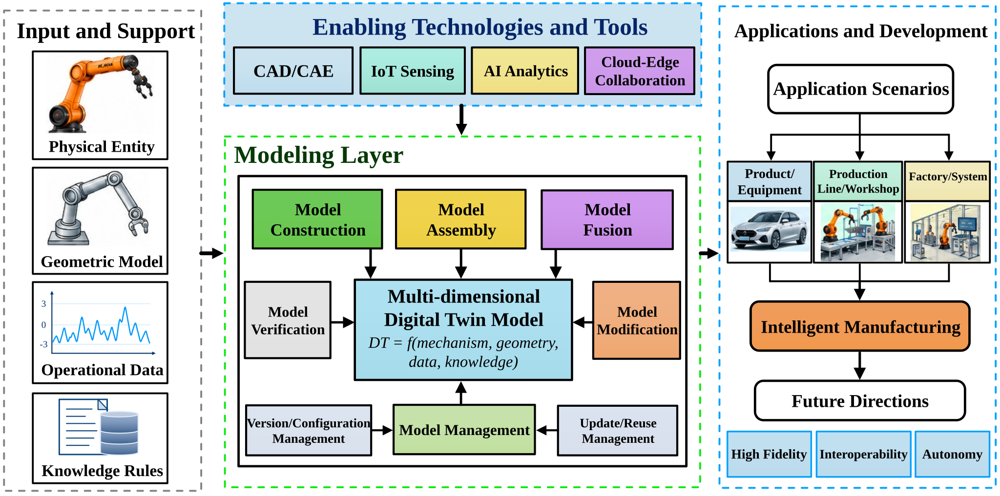
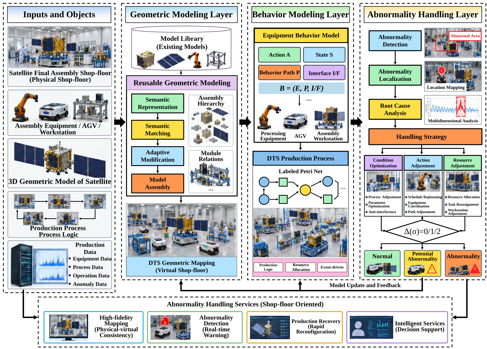
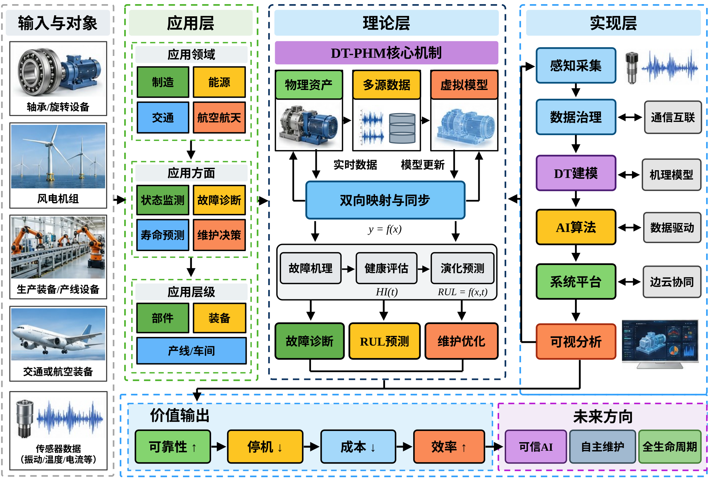
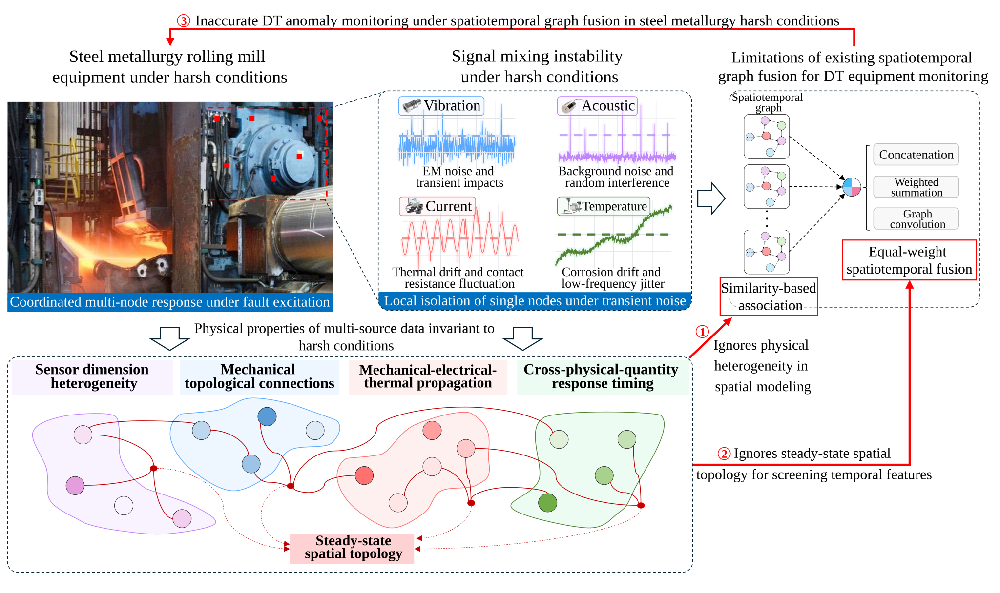
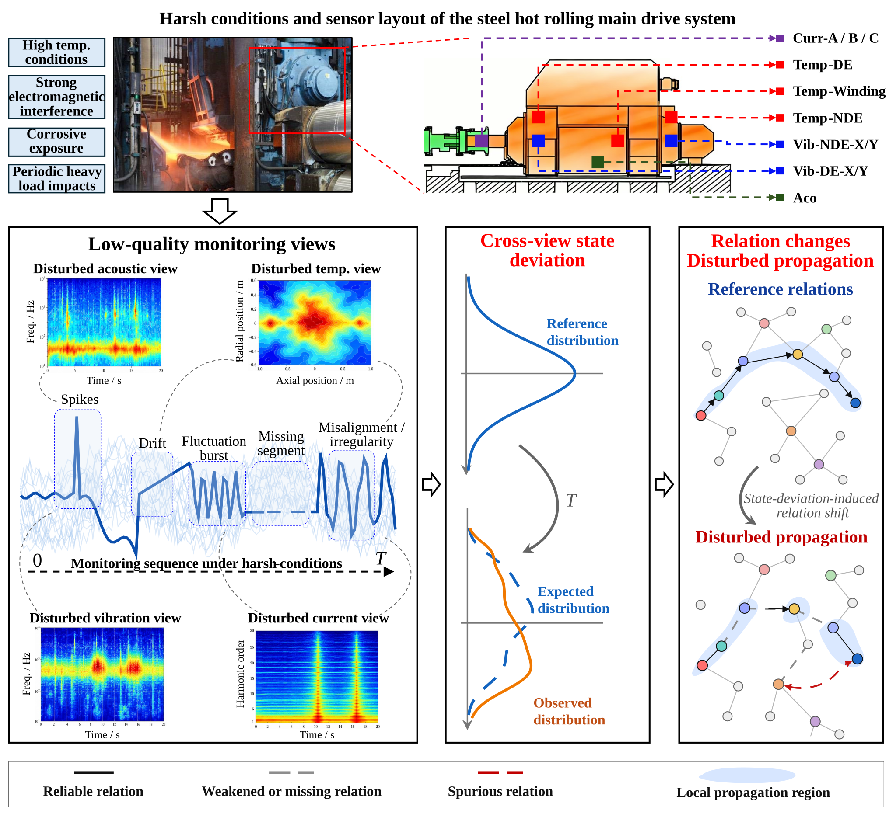
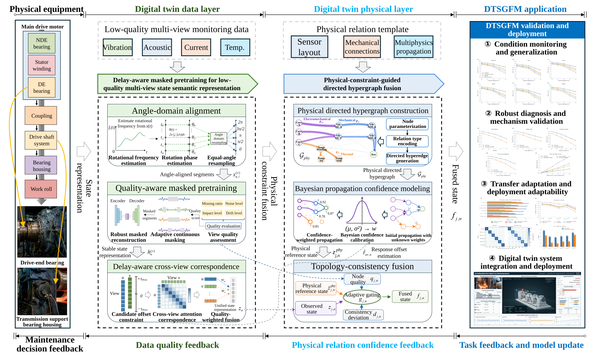

# Bin Xiao

**Ph.D. Researcher in Mechanical Engineering | Shanghai Jiao Tong University**

Shanghai, China · [xiaobinsjtu@gmail.com](mailto:xiaobinsjtu@gmail.com) · [GitHub](https://github.com/XiaoBinSJTU) · [LinkedIn](https://www.linkedin.com/in/bin-xiao-b00195359/)

[Research Profile](#research-profile) · [Education](#education) · [Publications](#publications) · [Selected Research Projects](#selected-research-project) · [Patents & Software Copyrights](#patent-applications--software-copyrights)

---

## Research Profile

1. **Digital Twin-Based Model Updating:** Model reuse and coordinated updates of mechanism, geometric, and algorithm models.
2. **Physics-Guided Hypergraph Fusion:** Robust spatiotemporal multi-sensor fusion under harsh industrial conditions.
3. **PHM-Oriented Equipment Monitoring:** Anomaly detection, health assessment, degradation prediction, and intelligent maintenance.
4. **Digital Twin-Driven Manufacturing Decisions:** Shop-floor abnormality handling and multilevel hypergraph reasoning for robotic slag removal.

## Education

**Shanghai Jiao Tong University**, Ph.D. in Mechanical Engineering | Apr 2023–Mar 2027 (expected)  
**Advisor:** [Prof. Yu Zheng](https://me.sjtu.edu.cn/en/FullTimeTeacher/zhengyu.html) | [Google Scholar](https://scholar.google.com/citations?user=jeQjSFEAAAAJ&hl=zh-CN)

**Beihang University**, M.Eng. in Control Engineering | Sep 2020–Jan 2023  
**Advisor:** [Prof. Fei Tao](https://shi.buaa.edu.cn/taofei/en/index.htm) | [Google Scholar](https://scholar.google.com/citations?user=-LQGKncAAAAJ&hl=en)

**Anhui Polytechnic University**, B.Eng. in Automation | Sep 2016–Jun 2020  
**Advisor:** [Prof. Huacai Lu](https://sciprofiles.com/profile/1495187) | [ResearchGate](https://www.researchgate.net/scientific-contributions/Hua-Cai-Lu-2025145043)  
**Undergraduate Honor:** National Scholarship, Ministry of Education of the People's Republic of China (2017–2018 academic year; awarded Dec 20, 2018).

**English Proficiency:** [Shanghai Intermediate-Level English Interpretation Certificate](http://www.shwyky.net/portal/) (Jun 2018); [Shanghai Advanced-Level English Interpretation Examination](http://www.shwyky.net/portal/) (Fall 2018).

## Publications

**Seven research works:** four peer-reviewed publications and three manuscripts under review. Graphical abstracts are displayed below their respective publications.

### Peer-Reviewed Publications

#### [1] Digital twin modeling

F. Tao, **B. Xiao**, Q. Qi, J. Cheng, and P. Ji. *Journal of Manufacturing Systems*, 64, 372–389 (2022).  
**Second author (first student author)** · JCR Q1 · Reported IF: 14.9

**Research Highlights**  
This review examines the modeling foundations that enable digital twins to represent physical entities and deliver monitoring, simulation, prediction, and optimization services. It compares digital twin models across application fields, system hierarchies, disciplines, dimensions, universality, and functionality, then organizes the literature around six modeling activities: construction, assembly, fusion, verification, modification, and management. It also surveys enabling technologies and tools.

**Paper:** [Read the published article](https://doi.org/10.1016/j.jmsy.2022.06.015)

#### [2] Multi-dimensional modeling and abnormality handling of digital twin shop floor

**B. Xiao**, Q. Qi, and F. Tao. *Journal of Industrial Information Integration*, 35, 100492 (2023).  
**First author** · JCR Q1 · Reported IF: 11.2

**Research Highlights**  
This research develops a multidimensional digital twin shop-floor framework that links geometric models, equipment behavior, and production abnormality handling. Existing 3D models are reused through semantic representation, matching, adaptive modification, and assembly. Equipment actions and states are connected using labeled Petri nets to detect abnormalities, localize affected behaviors, and guide production recovery. The approach is demonstrated in an aerospace product assembly shop-floor case.

**Experimental context:** Aerospace product assembly shop-floor modeling, AGV behavior representation, and abnormality localization.

**Source Code:** [dt-shopfloor-abnormality-handling](https://github.com/XiaoBinSJTU/dt-shopfloor-abnormality-handling)

**Paper:** [Read the published article](https://doi.org/10.1016/j.jii.2023.100492)

#### [3] Digital twin-driven prognostics and health management for industrial assets

**B. Xiao**, J. Zhong, X. Bao, L. Chen, J. Bao, and Y. Zheng. *Scientific Reports*, 14, 13443 (2024).  
**First author** · JCR Q1 · Reported IF: 4.9

**Research Highlights**  
This review systematically organizes digital twin-driven prognostics and health management (DT-PHM) for industrial assets. It examines where DT-PHM is applied across industries and asset hierarchies, explains its theoretical mechanisms for fault diagnosis, health assessment, and prognostics, and surveys implementation technologies for sensing, digital twin modeling, algorithms, and platforms. It also identifies open challenges and future directions for reliable industrial maintenance.

**Paper:** [Read the published article](https://doi.org/10.1038/s41598-024-63990-0)

#### [4] Model updating approach for digital twin-driven industrial equipment monitoring

**B. Xiao**, L. Chen, X. Zhou, J. Zhong, Z. Wang, S. Qiu, and Y. Zheng. *Advanced Engineering Informatics*, 74, 104678 (2026).  
**First author** · JCR Q1 · Reported IF: 11.2

**Research Highlights**  
This work proposes proactive degradation-aware model update decisions and coordinated updates of digital twin mechanism, geometric, and algorithm models. Global tracking degradation and local mechanism changes jointly trigger updates, while geometric corrections and retrained algorithm components maintain model consistency. In a belt conveyor bearing case, the approach reported 24.7-hour early warning, 40% lower tracking error, and 96% fault-detection AUC.

**Experimental context:** Industrial belt conveyor bearing monitoring and multidimensional digital twin update validation.

**Source Code:** [dt-model-updating](https://github.com/XiaoBinSJTU/dt-model-updating)

**Paper:** [Read the published article](https://doi.org/10.1016/j.aei.2026.104678)

### Manuscripts Under Review

The following manuscripts are under review at the journals indicated.

#### [5] Steady-state spatial guided spatiotemporal hypergraph data fusion for digital twin monitoring of industrial equipment under harsh operating conditions

**B. Xiao**, L. Chen, Y. Zheng, S. Qiu, and J. Bao. *Manuscript submitted to Mechanical Systems and Signal Processing*.  
**First author** · **Under Review** · Target journal: JCR Q1 · Reported IF: 10.2

**Research Highlights**  
This study addresses noisy monitoring in harsh steel-rolling environments through steady-state spatial guided spatiotemporal hypergraph fusion. Heterogeneous sensors and physically grounded hyperedges encode fault coordination, subsystem propagation, and response coherence. Spatial topology features guide cross-attention screening and residual correction of short- and long-term temporal signals. Experiments on rolling-mill drives and public datasets evaluate anomaly monitoring robustness against transient disturbances.

**Experimental context:** φ650 hot-rolling main-drive motor and five public industrial datasets.

**Source Code:** [steady-state-hypergraph-fusion](https://github.com/XiaoBinSJTU/steady-state-hypergraph-fusion)

#### [6] Digital twin spatiotemporal graph fusion modeling for low-quality multi-view equipment monitoring under harsh operating conditions

**B. Xiao**, L. Chen, Y. Zheng, and J. Bao. *Manuscript submitted to Advanced Engineering Informatics*.  
**First author** · **Under Review** · Target journal: JCR Q1 · Reported IF: 11.2

**Research Highlights**  
This work develops Digital Twin Spatiotemporal Graph Fusion Modeling (DTSGFM) for low-quality multi-view monitoring. Angle-domain alignment, quality-aware masked pretraining, and delay-aware correspondence stabilize heterogeneous sensor states. A physically constrained directed hypergraph combines Bayesian relation confidence with topology-consistency correction to limit disturbance propagation. Evaluations under compound degradation, missing views, and cross-equipment transfer assess robust monitoring and adaptability.

**Experimental context:** Multi-view steel hot-rolling drives; controlled noise, drift, missing-view, and alignment degradation.

**Source Code:** [dtsgfm-multiview-monitoring](https://github.com/XiaoBinSJTU/dtsgfm-multiview-monitoring)

#### [7] Digital twin hypergraph cascade modeling for end-effector slag removal decisions in steelmaking slag-handling robots

**B. Xiao**, L. Chen, Y. Zheng, and J. Bao. *Manuscript submitted to Robotics and Computer-Integrated Manufacturing*.  
**First author** · **Under Review** · Target journal: JCR Q1 · Reported IF: 12.3

**Research Highlights**  
This study models how slag adhesion at a steelmaking robot end effector propagates into multilevel equipment-state changes. At the part level, multi-view hypergraphs fuse sensor responses; at the module level, physics-semantic hypergraphs propagate coupled states; at the system level, diagnostic knowledge hypergraphs produce traceable slag-removal decisions. The reported results include 91.2% offline decision accuracy and 92.7% online event-level F1.

**Experimental context:** Steelmaking slag-handling robot operations with offline and online decision evaluation.

**Source Code:** [dt-hypergraph-slag-removal](https://github.com/XiaoBinSJTU/dt-hypergraph-slag-removal)

## Selected Research Project

**National Key Research and Development Program of China** | Jan 2021 – Dec 2023  
*Theory and Methods for Accurate Modeling of Intelligent Production Processes Based on Digital Twins* (Project No. **2020YFB1708400**)  
Developed event-triggered anomaly detection, labeled Petri net-based abnormality detection, and web-based digital twin model assembly and management capabilities.

**MCC Baosteel Collaboration** | Feb 2023 – Dec 2023  
*Intelligent Maintenance of Belt Conveyor Systems*  
Investigated bearing dynamics, physics-based numerical simulation, multi-sensor fusion, and intelligent condition monitoring.

**China Mobile Collaboration** | Jan 2024 – May 2024  
*Industrial Metaverse and Digital Twin Modeling*  
Worked on neural rendering, cross-modal semantic alignment, transfer learning, and industrial PHM interfaces.

**National Natural Science Foundation of China (NSFC) General Program** | From Jan 2024  
*Digital Twin Modeling Methods and Automated Model Generation for Equipment Anomaly Monitoring*  
Research on equipment digital twin modeling, model adaptation, automated model generation, and robust anomaly monitoring.

## Patent Applications & Software Copyrights

1. Q. Qi, **B. Xiao**, Y. Cheng, and F. Tao, “A Geometric Modeling Method for Digital Twin Workshop Based on Model Reuse.” Chinese invention patent application **CN202211405300.9** (2023). [Google Patents](https://patents.google.com/patent/CN115619191A/en). **First Student Inventor and Primary Technical Contributor.**

2. Q. Qi, **B. Xiao**, Y. Cheng, and F. Tao, “Digital Twin Exception Handling Method Based on Model Fusion.” Chinese invention patent application **CN202211405316.X** (2023). [Google Patents](https://patents.google.com/patent/CN115630826A/en). **First Student Inventor and Primary Technical Contributor.**

**Software Copyright:** *Digital Twin Model Management System V1.0* (Reg. No. **2021R11S1937871**; [China Copyright Protection Center — registration lookup](https://register.ccopyright.com.cn/query.html)). **First Student Contributor, Lead Software Developer and Primary Code Contributor.**

## Contact

For academic collaboration or postdoctoral opportunities, contact me at [xiaobinsjtu@gmail.com](mailto:xiaobinsjtu@gmail.com) or via [LinkedIn](https://www.linkedin.com/in/bin-xiao-b00195359/).
